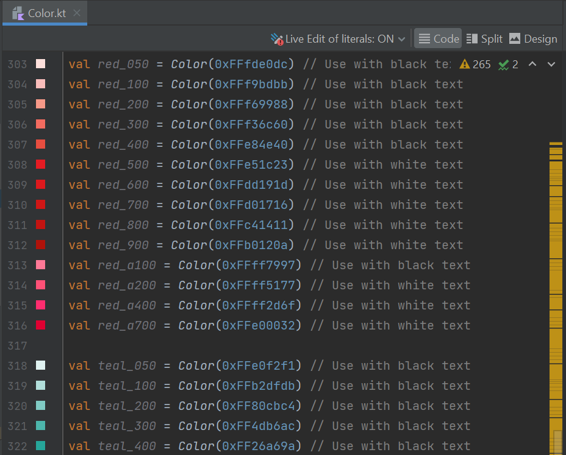

# Jetpack Compose Navigation and Material3 Starter Template

This project is designed to help you get started with a simple Modern Android Development (MAD) project.

It is purpose designed to be *very* simple, as a way to get started, so you can add your own customizations.

## Template Contents

Project includes:
* 100% Kotlin
* Material3 Implementation:
  * Typography
  * Color
  * Dimensions
  * Shape
* Jetpack Compose Navigation
  * Deep linking
* Jetpack Compose screens
  * LazyList
  * Input/Button
  * BottomSheet
* Material Icons
* Compose Tests
  * Simple starting test, not full coverage
* Project configuration
  * Static analysis
  * Android Studio Integrations
  
It *does not* include:
* Architecture guidance
  * No Use-cases, etc
* Additional frameworks
  * No dependency injection

### Additions

#### Color

The [Color.kt](com/wolfsoft/demo/ui/theme/Color.kt) file is formatted so you can copy/paste a color definition directly from the [Material Theme Builder](https://material-foundation.github.io/material-theme-builder/#/custom)

It also includes color definitions for all the original M2 colors.



#### Static Analysis

I included static analysis tooling in the build for this project. These tools help maintain consistency and are worth including in all projects.

To run static analysis on this project, execute:

```gradle
./gradlew lint ktlintcheck detekt
```

This repo has [configuration](buildscripts/githooks.gradle) to automatically setup a pre-commit hook requiring the developer to pass static analysis before being able to commit PRs.

#### Remote Image Caching (Coil)

I'm using the [Coil](https://coil-kt.github.io/coil/) image caching library to make the demo a bit nicer.

#### Android Studio Configuration

There are a few Android Studio integrations in the project worth calling out:

* [code style](.idea/codeStyles/Project.xml) - establishes consistent formatting
* [code insight settings](.idea/codeInsightSettings.xml) - [eliminates certain values](https://www.jetpackcompose.app/articles/productivity-hack-to-save-tens-of-engineering-hours-when-working-with-Jetpack-Compose) from showing up in auto-complete, making dev life happier 
* [plugin dependency list](.idea/externalDependencies.xml) - list of essential plugins

#### Continuous Integration(CI) - Using Github Actions

The [initial configuration](.github/workflows/android.yml) is included for building on Github Actions. The build compiles the APKs, if static analysis completes without issue.

To disable CI - delete the configuration file.

Build status is:


## Demo


## How to Use

[Creating a Repository From A Template](https://docs.github.com/en/repositories/creating-and-managing-repositories/creating-a-repository-from-a-template)

## Near Future Plans

* More Compose Tests - just enough to get started in different areas of testing.
* Repository

## Contributors

Special thanks for the great input from:
* [Atom Raiff](https://github.com/atommarvel)

## Comments Welcome
Please contact me if you have any comments or suggestions.
[Twitter: mikewolfson](https://twitter.com/mikewolfson)


